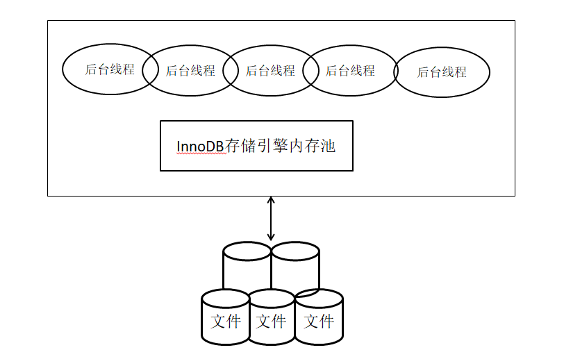
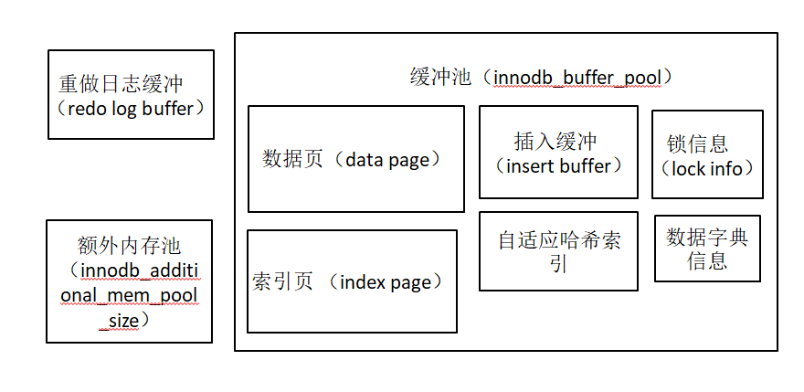

## MySQL基础

## MySQL基本架构图


MySQL 大致可以分为Server层和存储引擎层两部分

Server层包含连接器、分析器、优化器、执行器、查询缓存等，以及所有的内置函数（如日期、时间

数学和加密函数等），所有跨存储引擎的功能都在这一层实现，比如存储过程、触发器、视图等。

## InnoDB体系架构

### InnoDB体系架构图



InnoDB存储引擎有多个内存块组成了一个大的内存池。

后台线程的主要作用是负责刷新内存池中的数据，保证缓冲池中的内存缓存的是最近的数据。此外将已修改的数据文件刷新到磁盘文件，同时保证在数据库发生异常的情况下InnoDB能恢复到正常状态。

### 后台线程

* Master Thread：非常核心的后台线程，主要负责将缓冲池中的数据异步刷新到磁盘，保证数据的一致性，包括脏页的刷新、合并插入缓冲、undo页的回收等。

* IO Thread：主要负责IO请求的回调处理。

* * read thread
  * write thread
  * insert buffer
  * log IO thread

InnoDB引擎1.0版本之前，分别有以上四个IO线程，从1.0.x以后，write和read 分别增加到了4个。

分别通过innodb_read_io_thread和innodb_write_io_thread 参数控制

* Purge Thread：回收已经使用并分配的undo页。在innodb1.1版本以前，purge操作在master thread中完成，1.1版本以后独立到单独的线程中完成。可在配置文件中配置启用独立的purge thread

```shell
[mysqld]
innodb_purge_threads=1
# 在1.1版本之前，如果将此参数设置为大于1的数，innodb存储引擎也启动时也会将其设置为1，并在错误文件中出现提示
# 从1.2版本开始，支持多个purge thread，目的是为了进一步加快undo页的回收。由于purge thread 需要离散的读取undo页，也能更进一步利用磁盘的随机读取性能，用户也可以设置4个purge thread
```

* Page Cleaner Thread：在innodb1.2.下x版本中引入的，将之前版本中脏页的刷新操作都放到单独的线程中完成，减轻原Master Thread的工作以及对于用户查询线程的阻塞，提高innodb存储引擎的性能

  

### 内存

#### 内存结构



由图可知：缓冲池中缓存的数据页类型有：索引页、数据页、undo页、插入缓冲、自适应哈希索引、innodb存储的锁信息、数据字典等。

### 重做日志缓冲

重做日志在下列三种情况下会将重做日志缓冲中的内容刷新到外部磁盘的重做日志文件中

```shell
1 Master Thread 每一秒将重做日志缓冲刷新到重做日志文件
2 每个事物提交时将重做日志缓冲刷新到重做日志文件
3 当重做日志缓冲池剩余空间小于1/2时，重做日志缓冲刷新到重做日志文件
```


## Checkpoint技术

Checkpoint（检查点）技术解决以下几个问题

```shell
1 缩短数据库的恢复时间（Checkpoint机制定时将重做日志中的数据刷新回磁盘，宕机恢复时只需恢复还未刷新到磁盘的页）
2 缓冲池不够用时，将脏页刷新到磁盘
3 重做日志不可用时，刷新脏页
脏页：缓冲池中的页修改了但是还没刷新到磁盘的页，即缓冲池中的页比磁盘中的页的数据产生了不一致。数据库会通过Checkpoint机制将脏页刷新回磁盘
```

