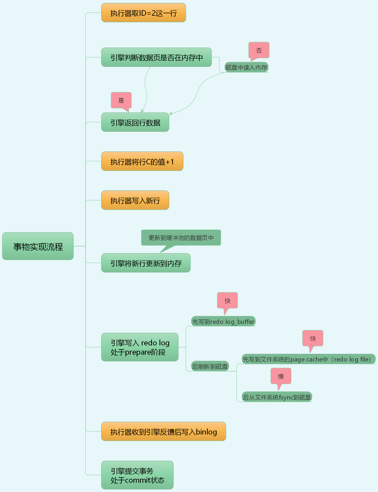
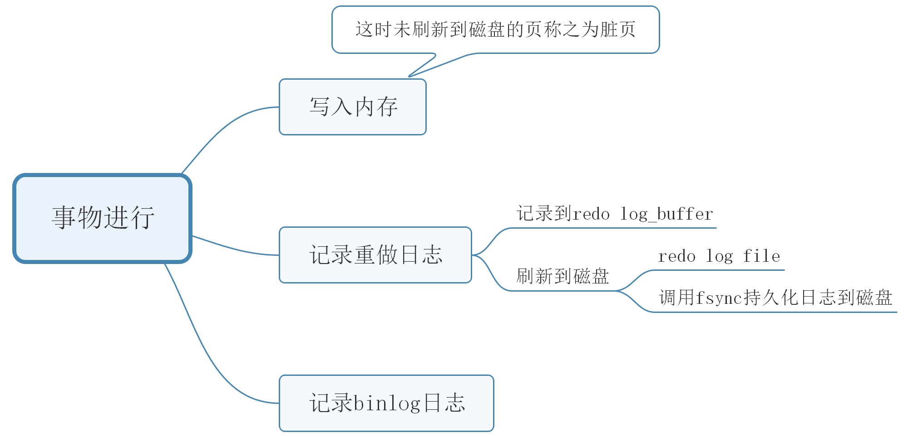

## 事物

以update为例，描述语句的实现流程



>  图一

途中的commit指的是innodb引擎内部的commit步骤，和显示的commit提交不一样。显示的commit操作包括commit步骤，commit步骤是事务提交的最后一步。

### 两阶段提交

1 上图中提到一个概念：两阶段提交

2 两阶段提交：redo log 先prepare 后commit

3 为什么要两阶段提交：为了保证两个日志的逻辑性一致。

4 如果没有两阶段提交

* 先写redo log，后写binlog：在写完redo log 后还没有写binlog。由于记录了redo log，就算数据库崩溃后也能恢复。但是binlog中没有记录，如果使用binlog恢复数据库的话，就会丢失数据，此时数据是不一致的状态
* 先写binlog，后写redo log：写完binlog后redo log没写，数据库崩溃了，恢复出来的数据没有，但是通过binlog恢复数据库的时候，数据多了，此时数据库状态也是不一致的状态

5 为什么有两阶段提交就能保证数据一致性了呢

数据库进行崩溃恢复的时候，首先看redo log中是否有commit字段，如果有的话意味着事物之前已经提交，看到commit，直接提交

没有commit的 有两种情况

* redo log 写完了，binlog没写，此时事物也没提交。数据库进行崩溃恢复的时候看到redo log 已经prepare，会找相应的binlog，找不到相应的日志，数据库认为此事物不完整，事物回滚
* redo log 写完了，binlog也写完了，此时事物也没提交。数据库进行崩溃恢复的时候看到redo log 已经prepare，会找相应的binlog，若找到相应的日志，则次事物是完整的，数据库是认可的，也会提交

### 事物特性

- A，原子性：整个数据库事物是不可分割的工作单位，，只有使事物中所有的数据库操作都执行成功，才算整个事物成功。事物中任何一个SQL语句执行失败，已经执行成功的SQL语句也必须撤销，数据库状态应该回退到执行事务之前的状态。
- C，一致性：指事物将数据库从一种状态变为下一种一致性的状态。在事物开始之前和事物结束以后，数据库的完整性约束没有被破坏。事物是一致性的单位，如果事物中某个动作失败了，系统可以自动撤销事物—返回初始状态。
- I，隔离性：隔离性还有其他的称呼，如并发控制、可串行化、锁等。事物的隔离性要求每个读写事物的对象对其他事物的操作对象能互相分离，即该事物提交前对其他事物都不可见，通常这使用锁来实现。
- D，持久性：事物一旦提交，其结果就是永久性的。即使发生宕机等故障，数据库也能将数据恢复。需要注意的是，只能从事物本身的的角度来保证结果的永久性。即使当数据库因为崩溃而需要恢复时，也能保证恢复后提交的数据都不会丢失。但若不是由于数据库本身发生故障，而是由于外部的原因，如RAID卡损坏、自然灾害等原因导致数据库发生问题，那么所有提交的数据可能都会丢失。


### 事物的实现

redo log成为重做日志，用来保证事物的原子性和持久性。undo log用来保证事物的一致性

redo 和 undo 的作用都可以视为一种恢复操作，redo 恢复提交事物修改的页操作，而undo 回滚行记录到某个版本。redo 通常是物理日志，记录的是页的物理修改操作。undo 是逻辑日志，根据每行记录进行记录。

#### redo log

重做日志由两部分组成：一是内存中的重做日志缓冲，其是易失的；二是重做日志文件，其是持久的。

以update为例，事物进行修改时，先记录redo log（先将内容写进redo log_buffer,再刷新到日志文件（redo log file）） ，并更新内存，后续按照一定机制再刷新到磁盘，就是常说的WAL机制，即先写日志，再写磁盘。这样就算数据库崩溃后，由于记录了redo log也能恢复。

文中提到的刷新到磁盘是指刷新内存中的脏页。事物进行更改时，会先在内存中进行更改，后续通过一定过的机制刷新到磁盘，此时内存中的页和磁盘上的页发生了不一致，这种页称之为脏页。




> 图二

##### redo log 的写入机制

事务在执行过程中，生成的 redo log 是要先写到 redo log buffer

redo log 的三种状态


三种状态分别是：

1 存在redo log buffer中，物理上是在MySQL进程内存中，为图中红色部分

2 写到磁盘（write），但是没有持久化（fsync），物理上是在文件系统的page cache里面，也就是图中黄色部分

3 持久化到磁盘，对应的是hard disk，图中的绿色部分

日志写到redo log buffer 很快，write到page cache也差不多，但是持久化到磁盘的速度比较慢

```shell
1 状态对应内存（数据库宕机数据会丢失）
2 状态对应操作系统（数据库宕机数据不会丢失，操作系统即主机意外重启数据会丢失）
3 状态对应磁盘
```

为了控制redo log 的写入策略，InnoDB提供了innodb_flush_log_at_trx_commit参数，他有三种可能取值

1 设置为0时，表示每次事务提交时都只把redo log buffer中；

2 设置为1时，表示每次事务提交时都只将redo log 直接持久化到磁盘；

3 设置为2时，表示每次事务提交时都只把redo log 写到page cache。

另外，InnoDB后台Master线程会每秒执行一次重做日志刷盘操作

```shell
# 事务未提交时：
1 设置为0  redo log buffer——每隔一秒——page cache——实时——disk
2 设置为1  redo log buffer——每隔一秒——page cache——实时——disk
3 设置为2  redo log buffer——每隔一秒——page cache——实时——disk

# 事物提交时：
1 设置为0  redo log buffer——每隔一秒——page cache——实时——disk
2 设置为1  redo log buffer——实时——page cache——实时——disk
3 设置为2  redo log buffer——实时——page cache——每隔一秒——disk
```

除后台线程每秒一次的轮询操作外，还有两种场景会让一个没有提交的事物的redo log写入到磁盘中

1 一种是，redo log buffer 占用的空间即将达到innodb_log_buffer_size一半的时候，线程会主动写盘。注意《由于事物没有提交，所以写盘动作只是write，而没有调用fsync，也就是只留在了文件系统的page cache

2 另一种是，并行的事物提交的时候，顺带将这个事物redo log buffer持久化到磁盘，假设一个事物A执行到一半了，已经写了一些redo log到buffer，这时候有另外一个线程的事务B提交，如果innodb_flush_log_at_trx_commit设置的是1，那么按照这个参数的逻辑，事物B要把redo log buffer 里的日志全部持久化到磁盘。这时候，就会带上事物A在redo log buffer里的日志一起持久化到磁盘

如果把innodb_flush_log_at_trx_commit设置成1，那么redo log 在prepare阶段就要持久化一次，因为有一个崩溃恢复逻辑要依赖于prepare的redo log，再加上binlog来恢复的。

每秒一次后台轮询刷盘，再加上崩溃恢复这个逻辑，InnoDB就认为redo log在commit的时候就不需要fsync了，只会write到文件系统的page cache中就够了

#### undo log

#### purge

#### group commit


