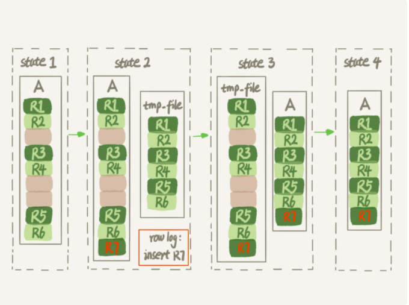
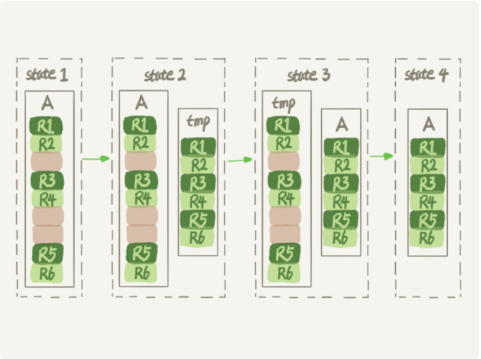

### online DDL

**InnoDB引擎不同操作的锁类型**

| 操作          | 锁类型                                              | 备注                                                         |
| ------------- | --------------------------------------------------- | ------------------------------------------------------------ |
| DDL           | MDL写锁、MDL读锁（在做onlineDDL的时候会降级成读锁） | **MDL写锁**的目的是为了**禁止其线程对表同时做DDL**操作<br>**MDL读锁**的目的是为了实现**Online**，MDL读锁**不会阻塞增删改查**操作 |
| DML           | MDL读锁、行锁（写）                                 | **DML**语句产生的**MDL读锁**和**DDL**在**Online**时的**MDL读锁**不互斥 |
| DQL（select） | MDL读锁、行锁（读）、表锁（读）                     | 正常情况下DML语句和DDL语句是互斥的（MDL读锁和MDL写锁），为了保证数据结构的一致性<br/>**DQL**语句产生的**MDL读锁**和**DDL**在**Online**时的**MDL读锁**不互斥 |

MySQL 5.6版本以后支持Online DDL

**MySQL Online DDL操作流程**

| 序号 | 步骤          | 明细                                                         | 备注                                    |
| ---- | ------------- | ------------------------------------------------------------ | --------------------------------------- |
| 1    | 获取MDL写锁   | 获取完以后不允许增删改操作                                   | 目的为了防止其他线程同时对表进行DDL操作 |
| 2    | 降级成MDL读锁 | 降级完以后可以进行增删改操作                                 | 目的为了以下步骤可以实现Online          |
| 3    | 做DDL         | 1.建立临时文件，扫描表A主键的所有数据页<br>2.用数据页中表A的记录生成B+树，存储到临时文件中<br>3.生成临时文件的过程中，将所有对表A的操作记录在一个日志文件（row log）中<br>4.临时文件生成后，将日志文件中的操作应用到临时文件，得到一个逻辑数据上与表A相同的数据文件<br> |                                         |
| 4    | 升级成MDL写锁 | 用临时文件替换表A                                            | 做Rename操作                            |
| 5    | 释放MDL锁     |                                                              |                                         |

对于大表来说，Online DDL最耗时的是拷贝数据到临时表的过程，这个步骤执行期间可以接受增删改操作，相对整个DDL过程来说，锁的时间非常短，对于业务来说可以认为是Online的

### Inpalce

```shell
# 重建表
alter table t engine=innodb
```

**MySQL 5.6版本以后recreate的流程**

表A重建出来的数据是放在tmp_file里的，这个临时文件是InoDB在内部创建出来的，整个DDL过程都是在InnoDB内部完成，对于Server层来说，没有把数据挪动到临时表，是一个**原地**操作

其实相当于

```shell
alter table t engine=innodb,ALGORITHM=inplace;
```

如图



### copy

跟Inplace对应的方式是拷贝表的方式，用法是

```shell
alter table t engine=innodb,ALGORITHM=copy;
```

当使用ALGORITHM=copy的时候，表示强制拷贝表，临时表tmp_file是在server层创建的，会阻塞增删改操作

如图



### Inplace和copy区分


### Online和Inplace 之间的关系

1 是否是Online看是否堵塞增删改操作，是否是Inplace看是否是在InnoDB引擎内部创建临时表

2 如果DDL操作时Online的，那就一定是Inplace的

3 如果DDL是Inplace的，不一定是Online的，例如添加全文索引和空间索引就属于此情况

**MySQL 5.6版本以后**

### 操作表对比

| 操作                             | 明细                                 | 备注             |
| -------------------------------- | ------------------------------------ | ---------------- |
| alter table t engine=innodb 操作 | recreate                             | 对应如上，重建表 |
| analyze table                    | 对表的索引信息重新统计，没有修改数据 | 加MDL读锁        |
| optimize table                   | 相当于recreate+analyze               |                  |

