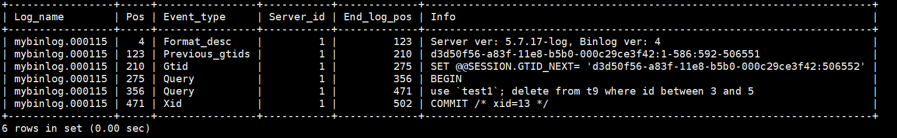
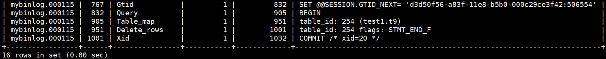

## 复制的工作原理

### 步骤

**基本可以分为3个步骤**

* 主服务器（master）把数据更改记录到二进制日志（binlog）中；
* 从服务器（slave）把主服务器的二进制日志复制到自己的中继日志（rela log）中；
* 从服务器 重做中继日志的日志，把更改应用到自己的数据库上，以达到数据的最终一致性。


**在以上过程中涉及到三个线程：**

* 主服务器：binlog dump线程，将binlog中的内容发送给从服务器上的IO线程
* 从服务器：IO线程负责拉取主binlog日志放到中继日志中；SQL线程负责读取中继日志并执行。

**事物日志同步的完整过程：**

1、在备库上 通过change master 命令，设置主库的IP、端口、用户名、密码，以及要从哪个位置开始请求 binlog，这个位置包含文件名和日志偏移量。

2、在备库 上执行 start slave 命令，这时候备库会启动两个线程，就是 io_thread 和 sql__thread。其中 io_thread 负责与主库建立连接。

3、主库 校验完用户名、密码后，开始按照备库 传过来的位置，从本地读取 binlog，发给备库。

4、备库 拿到 binlog 后，写到本地文件，称为中转日志（relay log）。

5、sql_thread 读取中转日志，解析出日志里的命令，并执。

**可通过shou full processlist\G;  查看从服务器的状态**

```shell
*************************** 1. row ***************************
   ID:1
  User:system user
  Host:
   db:NULL
Command:Connect
   Time:6501
  State:Wait for master to send event
   Info:Null
*************************** 1. row ***************************
   ID:1
  User:system user
  Host:
   db:NULL
Command:Connect
   Time:0
  State:Has read all relay log;wait for the slave I/O thread to update it
   Info:Null
```

可以看到，ID为1的线程是IO线程，目前的状态就是等待主服务器发送二进制日志。ID为2的线程是SQL线程，负责读取中继日志并执行。目前的状态是已读取所有的中继日志，等待中继日志被I/O线程更新。


```shell
show slave status\G;

*************************** 1. row ***************************
               Slave_IO_State: Waiting for master to send event
                  Master_Host: 192.168.174.5
                  Master_User: slave
                  Master_Port: 3306
                Connect_Retry: 60
              Master_Log_File: mysql-bin.000007
          Read_Master_Log_Pos: 555176471
               Relay_Log_File: gamedb-relay-bin.021949
                Relay_Log_Pos: 224355889
        Relay_Master_Log_File: mysql-bin.000007
             Slave_IO_Running: Yes
            Slave_SQL_Running: Yes
              Replicate_Do_DB: 
          Replicate_Ignore_DB: 
           Replicate_Do_Table: 
       Replicate_Ignore_Table: 
      Replicate_Wild_Do_Table: 
  Replicate_Wild_Ignore_Table: mysql.%,sys.%,information_schema.%
                   Last_Errno: 0
                   Last_Error: 
                 Skip_Counter: 0
          Exec_Master_Log_Pos: 555176471
              Relay_Log_Space: 224356045
              Until_Condition: None
               Until_Log_File: 
                Until_Log_Pos: 0
           Master_SSL_Allowed: No
           Master_SSL_CA_File: 
           Master_SSL_CA_Path: 
              Master_SSL_Cert: 
            Master_SSL_Cipher: 
               Master_SSL_Key: 
        Seconds_Behind_Master: 0
Master_SSL_Verify_Server_Cert: No
                Last_IO_Errno: 0
                Last_IO_Error: 
               Last_SQL_Errno: 0
               Last_SQL_Error: 
1 row in set (0.00 sec)
```

#### 主要变量

| 变量                  | 说明                                                         |
| --------------------- | ------------------------------------------------------------ |
| Slave_IO_State        | 显示当前IO线程的状态，上述状态显示的是等待主服务器发送二进制日志 |
| Master_Log_File       | 显示当前同步的主服务器的二进制日志                           |
| Read_Master_Log_Pos   | 显示当前同步到主服务器上的二进制日志的偏移量位置，单位是字节 |
| Relay_Master_Log_File | 当前中继日志同步的二进制日志（SQL线程重演到的二进制日志，可和Master_Log_File对比SQL线程是否有延迟） |
| Relay_Log_File        | 显示当前写入的中继日志                                       |
| Relay_Log_Pos         | 显示当前执行到中继日志的偏移量位置                           |
| Slave_IO_Running      | 从服务器中IO线程的运行状态                                   |
| Slave_SQL_Running     | 从服务器中SQL线程的运行状态                                  |
| Exec_Master_Log_Pos   | 表示同步到主服务器的二进制日志偏移量的位置（SQL线程重演到的日志偏移量位置），（Read_Master_Log_Pos-Exec_Master_Log_Pos）可以表示当前SQL运行的延迟，单位是字节 |

* Master_Log_File/Read_Master_Log_Pos：相对于主库，从库读取到主库的二进制日志的位置，对应的线程是IO线程
* Relay_Log_File/Relay_Log_Pos：相对于从库，是从库的SQL线程执行的位置
* Relay_Master_Log_File/Exec_Master_Log_Pos：相对于主库，是从库的SQL线程执行到的位置

#### 延迟分析

* IO线程延迟：主库写入的位置-从库拉取到的位置

在主库上:show master status\G;

```shell
*****************************1.row****************************            
            File:mysql-bin.000007
        Position:606181078
    Binlog_Do_DB:
Binlog_Ignore_DB:
```

当前二进制日志记录了偏移量606181078的位置，该值减去从服务器上的Read_Master_Log_Pos，就可以得知I/O线程的延时。

* SQL线程延迟：Read_Master_Log_Pos-Exec_Master_Log_Pos

数据库复制监控不应该仅仅监控从服务器上I/O线程和SQL线程运行的是否正常，同时也应该监控从服务器和主服务器之间的延迟，确保从服务器上的数据库总是尽可能的接近于主服务器上数据库的状态

**问题**

```shell
# binlog 里是什么内容，为什么备库拉取后可以直接执行？
```

我们 带着个问题继续往下看

### binlog 的三种格式对比

* statement 格式

* row格式

* mixed格式（前两种格式的混合）

**statement 格式**


```shell
表中数据如下：
root@MySQL-01 16:19:  [test1]> select * from t9;
+-------+
| id    |
+-------+
|    -2 |
|     3 |
|     4 |
|     5 |
| 65535 |
| 65536 |
+-------+
6 rows in set (0.03 sec)
# 执行删除语句
root@MySQL-01 16:22:  [test1]> delete from t9 where id between 3 and 5;
# 查看binlog中内容
root@MySQL-01 16:22:  [test1]> show binlog events in 'mybinlog.000115';

```



```shell
图中 可以看出
1、，SET @@SESSION.GTID_NEXT=
2、BEGIN 与commit、对应，表示中间的是一个事物
3、第三行执行真实的语句之前，有一个use test1 命令，MySQL根据当前所在的库，自动添加，保证传到备库执行的时候不论当前的线程在哪个库里，都能正确的更新到test1库的t9表。
statement 格式下记录的是完整的sql原句
4、最后一行commit中，有xid=13。
# xid的意义：用于关联redolog 和binlog。在数据库崩溃恢复的情况下，如果碰到 处于prepare阶段而又没有commit的redo log，就使用Xid到binlog 中找对应的事物，如果有的话就提交，没有的话回滚
```

**row格式**



1、row格式没有了SQL的原文，而是替换成了两个event：Table_map 和 Delete_rows。

2、Table_map：用于说明接下来要操作的表是test1库的t9表

3、Delete_rows event，用于定义删除的行为

```shell

[root@localhost ~]#mysqlbinlog -vv /alidata/mysql/log/mybinlog.000115 --start-position=767;

BEGIN
/*!*/;
# at 905
#190630 16:52:28 server id 1  end_log_pos 951 CRC32 0xe21cf441 	Table_map: `test1`.`t9` mapped to number 254
# at 951
#190630 16:52:28 server id 1  end_log_pos 1001 CRC32 0x627ecd3c 	Delete_rows: table id 254 flags: STMT_END_F

BINLOG '
THgYXRMBAAAALgAAALcDAAAAAP4AAAAAAAEABXRlc3QxAAJ0OQABAwABQfQc4g==
THgYXSABAAAAMgAAAOkDAAAAAP4AAAAAAAEAAgAB//4DAAAA/gQAAAD+BQAAADzNfmI=
'/*!*/;
### DELETE FROM `test1`.`t9`
### WHERE
###   @1=3 /* INT meta=0 nullable=1 is_null=0 */
### DELETE FROM `test1`.`t9`
### WHERE
###   @1=4 /* INT meta=0 nullable=1 is_null=0 */
### DELETE FROM `test1`.`t9`
### WHERE
###   @1=5 /* INT meta=0 nullable=1 is_null=0 */
# at 1001
#190630 16:52:28 server id 1  end_log_pos 1032 CRC32 0x7d7c4225 	Xid = 20
COMMIT/*!*/;
SET @@SESSION.GTID_NEXT= 'AUTOMATIC' /* added by mysqlbinlog */ /*!*/;
DELIMITER ;
```

由上可知：

1、server id 1，表示这个事务是在 server_id=1的库上执行的。

2、每个 event 都有 CRC32 的值，这是因为参数 binlog_checksum 设置成了 CRC32。是一个主从校验的算法

3、Table_map event 显示接下来要打开的表，map到数字254。以上只是操作了一张表，如果操作多张表，每个表都有一个对应的Table_map event ，都会map到一个单独的数字，用于区分对不同表的操作

4、最后的Xid event 表示事物被正确的提交了

**区别对比**

```shell
# statement 格式，记录SQL语句原句
好处：占用空间小
坏处：可能导致主备不一致的情况、误操作恢复的时候无法恢复

# 为什么可能会导致主备数据不一致的情况？
delete from t where a>=4 and t_modified<='2018-11-10' limit 1;
这条语句执行的时候可能走a列的索引，删除a=4，t_modified=2018-11-9的列
也可能走索引t_modified删除a=5，t_modified=2018-11-10的列，由于statement格式记录的是SQL语句的原句，所以主库和备库可能会因为使用的索引不一致导致数据不一致

# row 格式，记录所有删除的行的信息
好处：不会导致主备数据不一致的情况、误操作的时候可以恢复
坏处：占用空间大，耗费资源，影响执行速度

```

**mixed 格式**

```shell
mixed 格式是 会自己判断SQL语句是否有可能引起主备不一致，如果有可能，就使用row格式，否则就是用statement格式。可以利用statement格式的有点，又避免了数据不一致的风险。但是数据误操作后可能无法恢复数据
```

