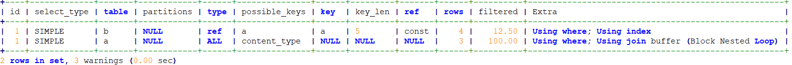
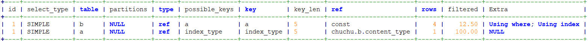

## SQL优化

[toc]

### JOIN

**JOIN的两种方式**

#### Index Nested-Loop Join

#### 连接字段数据类型转换导致索引失效

```shell
SELECT
 a.content_type AS type,
 a.content_name AS title
FROM
 `tbl_med_content_type` a 
right join tbl_med_project_content_type b on b.content_type=a.content_type
WHERE
   b.project_id = 5
   AND b.visit_type = 4 ORDER BY a.content_type ASC;  
```



执行计划看到被驱动表a没有使用到索引，Extra显示用了BNL

查看两个表的表结构

```shell
root@MySQL-01 02:41:  [chuchu]> show create table tbl_med_content_type;
-----------------------------------------------------------+
| Table                    | Create Table                                                 
-----------------------------------------------------------+
| tbl_med_content_type_bac | CREATE TABLE `tbl_med_content_type` (
  `id` int(11) NOT NULL,
  `content_type` char(11) DEFAULT NULL,
  `content_name` char(11) DEFAULT NULL,
  PRIMARY KEY (`id`)
) ENGINE=InnoDB DEFAULT CHARSET=utf8mb4 |
+--------------------------+-------------------------------------------------------------
1 row in set (0.01 sec)


root@MySQL-01 02:42:  [chuchu]> show create table tbl_med_project_content_type;
-----------------------------------------------------------------------------------------
| Table                        | Create Table                                             
-----------------------------------------------------------------------------------------
| tbl_med_project_content_type | CREATE TABLE `tbl_med_project_content_type` (
  `id` int(11) NOT NULL,
  `project_id` int(11) DEFAULT NULL,
  `content_type` int(11) DEFAULT NULL,
  `visit_type` int(11) DEFAULT NULL,
  PRIMARY KEY (`id`),
  UNIQUE KEY `a` (`project_id`,`content_type`,`visit_type`),
  KEY `content_type` (`content_type`)
) ENGINE=InnoDB DEFAULT CHARSET=utf8mb4 |
+------------------------------+---------------------------------------------------------
1 row in set (0.00 sec)
```

**分析：**

1、右连接时驱动表b的content_type和被驱动表a的content_type字段连接，表a的content_type字段有索引

2、但是在连接的时候两个表的content_type字段的类型不一致，表a的content_type类型为char，而表b为int，表a在连接时做了字符串类型转换，导致content_type列索引失效

**测试：**

将表acontent_type类型转换为int

```shell
root@MySQL-01 02:44:  [chuchu]> show create table tbl_med_content_type;
--------------------------------------------------------------------------------------+
| Table                | Create Table                                                     --------------------------------------------------------------------------------------+
| tbl_med_content_type | CREATE TABLE `tbl_med_content_type` (
  `id` int(11) NOT NULL,
  `content_type` int(11) DEFAULT NULL,
  `content_name` int(11) DEFAULT NULL,
  PRIMARY KEY (`id`),
  KEY `index_type` (`content_type`)
) ENGINE=InnoDB DEFAULT CHARSET=utf8mb4 |
--------------------------------------------------------------------------------------+
1 row in set (0.00 sec)
```

执行计划如下：



已使用索引


