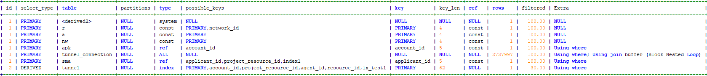
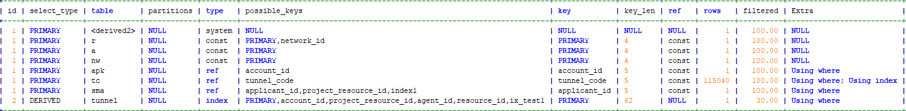

## SQL连接

[toc]


###连接查询的定义

在数据库中，一张表就是一个集合，每一行就是集合中的一个元素。表之间作联合查询即是作笛卡尔乘积，比如A表有5条数据，B表有8条数据，如果不作条件筛选（只有join 没有on），那么两表查询就有 5 X 8 = 40 条数据。

###连接的种类

####左连接

**以左表为准 ，左连接查询即 A表在左不动，B表在右滑动，A表与B表通过一个关系来关联行，B表去匹配A表。**

**左表取全部（全表扫描），左表中有的行，右表中没有的行用NULL来补充**

使用左连接查询时，如果on条件后的右表的列无重复值的话，连接后统计的行数实际是左表的行数

示例如下：

```shell
1 SELECT count(m.trans_no)
FROM v3_charge_trans_log m
	LEFT JOIN v3_charge_log t ON t.charge_no = m.charge_no
WHERE 1 = 1
	AND t.out_biz_no IS NOT NULL

# 两个表左连接以后，过滤右表中不为空的即是左表中有但是右表中没有的行，因为右表中没有的行才会显示为空
# 此语句是想取两个表的交集后统计行数 inner join，后面会提到

有以下改写方法：
 SELECT count(1)
  FROM v3_charge_trans_log m inner join v3_charge_log t ON t.charge_no= m.charge_no
直接使用inner join，过滤两个表中都存在的行，两个表中都满足条件的行，取交集，where条件都没有必要了。
# 注意：这种情况不用考虑右表中匹配的字段是否重复

 2 SELECT count(m.trans_no)
  FROM v3_charge_trans_log m
	LEFT JOIN v3_charge_log t ON t.charge_no = m.charge_no
 改写后 
 SELECT count(m.trans_no)
  FROM v3_charge_trans_log
 # 左连接后统计行数，如果连接条件中的右表中的字段无重复值的话，相当于统计左表的行数。
 # 注意：前提是右表中的字段无重复值，有重复值的话不可以这样改写
```



**如图：左连接返回阴影部分，若过滤右表中为空的部分，即是取交集**

#### 右连接

和左连接一样，不过是以右表为准

#### 内链接

**join...on...或inner join...on...**

内链接即取交集

* 左连接后过滤右表中为空的行即可以直接使用内链接
* 右连接后过滤左表中为空的行即可以是使用内连接



**如图：右连接返回的是阴影部分，同理要过滤左表中为空的行，即是取阴影部分**

```shell
root@MySQL-01 14:23:  [test1]> select * from t;
+------+-------+
| id   | name  |
+------+-------+
|    1 | alice |
|    2 | tom   |
|    3 | lili  |
+------+-------+
3 rows in set (0.00 sec)

root@MySQL-01 14:24:  [test1]> select * from t1;
+------+--------+
| id   | name   |
+------+--------+
|    2 | kaikai |
|    2 | mm     |
|    3 | nini   |
+------+--------+
3 rows in set (0.00 sec)

root@MySQL-01 14:24:  [test1]> select * from t2;
+------+------+
| id   | name |
+------+------+
|    1 | hihi |
|    3 | hao  |
|    3 | niji |
+------+------+
3 rows in set (0.00 sec)

select t.id,t.name from t left join t1 on t.id=t1.id left join t2 on t2.id=t.id;

+------+-------+
| id   | name  |
+------+-------+
|    3 | lili  |
|    3 | lili  |
|    2 | tom   |
|    2 | tom   |
|    1 | alice |
+------+-------+
5 rows in set (0.00 sec)

root@MySQL-01 14:33:  [test1]> select t.id,t.name,t1.name,t2.name from t left join t1 on t.id=t1.id left join t2 on t2.id=t.id;
+------+-------+--------+------+
| id   | name  | name   | name |
+------+-------+--------+------+
|    3 | lili  | nini   | hao  |
|    3 | lili  | nini   | niji |
|    2 | tom   | kaikai | NULL |
|    2 | tom   | mm     | NULL |
|    1 | alice | NULL   | hihi |
+------+-------+--------+------+
5 rows in set (0.00 sec)

root@MySQL-01 14:33:  [test1]> select t.id,t.name,t1.name,t2.name from t left join t1 on t.id=t1.id left join t2 on t1.id=t2.id;
+------+-------+--------+------+
| id   | name  | name   | name |
+------+-------+--------+------+
|    3 | lili  | nini   | hao  |
|    3 | lili  | nini   | niji |
|    2 | tom   | kaikai | NULL |
|    2 | tom   | mm     | NULL |
|    1 | alice | NULL   | NULL |
+------+-------+--------+------+
5 rows in set (0.01 sec)

root@MySQL-01 14:47:  [test1]> select a.id,a.name,t2.name from (select t.id,t1.name from t left join t1 on t.id=t1.id) as a left join t2 on a.id=t2.id;
+------+--------+------+
| id   | name   | name |
+------+--------+------+
|    3 | nini   | hao  |
|    3 | nini   | niji |
|    2 | kaikai | NULL |
|    2 | mm     | NULL |
|    1 | NULL   | hihi |
+------+--------+------+
5 rows in set (0.00 sec)

# 多个join连接时，第一个连接根据条件做笛卡儿积，第二个链接也根据条件做笛卡儿积，最后两个连接的结果显示在同一行
# 所以多连接并不是以第一个连接的结果集做为基础

```

#### union all 连接

两条语句的查询结果合并,即相当于两张表合并成一张表

适用情况：再条件中使用or 会无法利用索引，可以使用union all 来进行优化

```shell
root@MySQL-01 14:23:  [test1]> select * from t;
+------+-------+
| id   | name  |
+------+-------+
|    1 | alice |
|    2 | tom   |
|    3 | lili  |
+------+-------+
3 rows in set (0.00 sec)

root@MySQL-01 14:24:  [test1]> select * from t1;
+------+--------+
| id   | name   |
+------+--------+
|    2 | kaikai |
|    2 | mm     |
|    3 | nini   |
+------+--------+
3 rows in set (0.00 sec)

root@MySQL-01 14:24:  [test1]> select * from t2;
+------+------+
| id   | name |
+------+------+
|    1 | hihi |
|    3 | hao  |
|    3 | niji |
+------+------+
3 rows in set (0.00 sec)

root@MySQL-01 14:33:  [test1]> select t.id,t.name,t1.name from t left join t1 on t.id=t1.id union all select t1.id,t1.name,t2.name from t1 left join t2 on t1.id=t2.id;
+------+--------+--------+
| id   | name   | name   |
+------+--------+--------+
|    2 | tom    | kaikai |
|    2 | tom    | mm     |
|    3 | lili   | nini   |
|    1 | alice  | NULL   |
|    3 | nini   | hao    |
|    3 | nini   | niji   |
|    2 | kaikai | NULL   |
|    2 | mm     | NULL   |
+------+--------+--------+
8 rows in set (0.00 sec)

```

#### 交叉连接（

**cross join**

只做笛卡儿积

```shell
root@MySQL-01 10:45:  [test1]> select * from t cross join t1;
ERROR 2006 (HY000): MySQL server has gone away
No connection. Trying to reconnect...
Connection id:    6
Current database: test1

+------+-------+------+--------+
| id   | name  | id   | name   |
+------+-------+------+--------+
|    1 | alice |    2 | kaikai |
|    2 | tom   |    2 | kaikai |
|    3 | lili  |    2 | kaikai |
|    1 | alice |    2 | mm     |
|    2 | tom   |    2 | mm     |
|    3 | lili  |    2 | mm     |
|    1 | alice |    3 | nini   |
|    2 | tom   |    3 | nini   |
|    3 | lili  |    3 | nini   |
+------+-------+------+--------+
9 rows in set (0.00 sec)

root@MySQL-01 11:13:  [test1]> select * from t join t1;
+------+-------+------+--------+
| id   | name  | id   | name   |
+------+-------+------+--------+
|    1 | alice |    2 | kaikai |
|    2 | tom   |    2 | kaikai |
|    3 | lili  |    2 | kaikai |
|    1 | alice |    2 | mm     |
|    2 | tom   |    2 | mm     |
|    3 | lili  |    2 | mm     |
|    1 | alice |    3 | nini   |
|    2 | tom   |    3 | nini   |
|    3 | lili  |    3 | nini   |
+------+-------+------+--------+
9 rows in set (0.00 sec)

root@MySQL-01 11:13:  [test1]> select * from t,t1;
+------+-------+------+--------+
| id   | name  | id   | name   |
+------+-------+------+--------+
|    1 | alice |    2 | kaikai |
|    2 | tom   |    2 | kaikai |
|    3 | lili  |    2 | kaikai |
|    1 | alice |    2 | mm     |
|    2 | tom   |    2 | mm     |
|    3 | lili  |    2 | mm     |
|    1 | alice |    3 | nini   |
|    2 | tom   |    3 | nini   |
|    3 | lili  |    3 | nini   |
+------+-------+------+--------+
9 rows in set (0.00 sec)

# 这三种的效果是一样的，都是只做笛卡儿积
```

