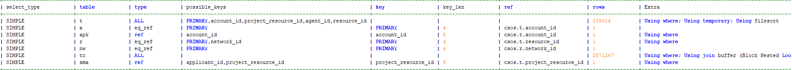
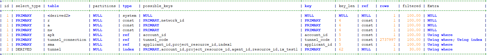

# SQL优化

[TOC]

## SQL详情

```shell
SELECT t.code AS t_code, t.account_id AS t_aid, t.type AS t_type, t.tmp_passwd AS t_tmp_pass, t.allow_ip AS t_allow_ip
	, t.safe_mode AS t_safe_mode, t.project_resource_id AS t_prid, nw.id AS nw_id, nw.safe_mode_approver AS nw_approver, nw.safe_mode AS nw_safe_mode
	, apk.pubkey AS apk_pub_key, COUNT(tc.id) AS tc_cnt, r.autologin AS r_autologin, r.csos_check AS r_csos_check, r.ip_address AS r_address
	, r.block_pattern AS r_bp, r.extension AS r_ext, r.name AS r_name, r.id AS r_id, r.resource_uid AS r_uid
	, r.resource_database AS r_db, r.resource_user AS r_user, a.pwd AS a_pwd, a.create_time AS a_create_time, sma.id AS sma_id
FROM tunnel t
	INNER JOIN resource r ON r.id = t.resource_id
	INNER JOIN account a ON a.id = t.account_id
	INNER JOIN network nw ON nw.id = r.network_id
	LEFT JOIN account_pubkey apk ON apk.account_id = t.account_id
		AND BINARY apk.pubkey = ''
	LEFT JOIN tunnel_connection tc ON BINARY tc.tunnel_code = t.code
		AND tc.online = 1
	LEFT JOIN safe_mode_application sma ON sma.`applicant_id` = a.id
		AND sma.`project_resource_id` = t.`project_resource_id`
		AND sma.app_status = 1
		AND sma.expire_time >= (
			SELECT UNIX_TIMESTAMP()
			)
WHERE BINARY t.code = 'WguEJs6C'
AND t.status != 'disable'
AND t.`expire_time` >= (
	SELECT UNIX_TIMESTAMP()
	)
GROUP BY t.code
LIMIT 1
```

## 执行计划分析

```shell
+--------------+-----------------------+-----------------+----------------+-------------------------------------------------------------+---------------------+-------------------+----------------------------+----------------+----------------------------------------------------+
| id           | select_type           | table           | type           | possible_keys                                               | key                 | key_len           | ref                        | rows           | Extra                                              |
+--------------+-----------------------+-----------------+----------------+-------------------------------------------------------------+---------------------+-------------------+----------------------------+----------------+----------------------------------------------------+
| 1            | SIMPLE                | t               | ALL            | PRIMARY,account_id,project_resource_id,agent_id,resource_id |                     |                   |                            | 339014         | Using where; Using temporary; Using filesort       |
| 1            | SIMPLE                | a               | eq_ref         | PRIMARY                                                     | PRIMARY             | 4                 | csos.t.account_id          | 1              |                                                    |
| 1            | SIMPLE                | apk             | ref            | account_id                                                  | account_id          | 5                 | csos.t.account_id          | 1              | Using where                                        |
| 1            | SIMPLE                | r               | eq_ref         | PRIMARY,network_id                                          | PRIMARY             | 4                 | csos.t.resource_id         | 1              | Using where                                        |
| 1            | SIMPLE                | nw              | eq_ref         | PRIMARY                                                     | PRIMARY             | 4                 | csos.r.network_id          | 1              |                                                    |
| 1            | SIMPLE                | tc              | ALL            |                                                             |                     |                   |                            | 2871267        | Using where; Using join buffer (Block Nested Loop) |
| 1            | SIMPLE                | sma             | ref            | applicant_id,project_resource_id                            | project_resource_id | 5                 | csos.t.project_resource_id | 1              | Using where                                        |
+--------------+-----------------------+-----------------+----------------+-------------------------------------------------------------+---------------------+-------------------+----------------------------+----------------+----------------------------------------------------+
返回行数：[7]，耗时：7 ms.
```



由执行计划分析，表t和tc表扫描行数最多，可重点关注

观察SQL语句分析

* 表t作为驱动表进行left join，最后有过滤条件，所以可以先将表t的结果集进行缩小后再作为驱动表进行连接。
* 表tc 相同的道理，也可以缩小结果集后进行连接

## 改写后的SQL

```shell
SELECT t.t_code, t.t_aid, t.t_type, t.t_tmp_pass, t.t_allow_ip
	, t.t_safe_mode, t.t_prid, nw.id AS nw_id, nw.safe_mode_approver AS nw_approver, nw.safe_mode AS nw_safe_mode
	, apk.pubkey AS apk_pub_key, COUNT(tc.id) AS tc_cnt, r.autologin AS r_autologin, r.csos_check AS r_csos_check, r.ip_address AS r_address
	, r.block_pattern AS r_bp, r.extension AS r_ext, r.name AS r_name, r.id AS r_id, r.resource_uid AS r_uid
	, r.resource_database AS r_db, r.resource_user AS r_user, a.pwd AS a_pwd, a.create_time AS a_create_time, sma.id AS sma_id
from (SELECT resource_id,code AS t_code, account_id AS t_aid, type AS t_type, tmp_passwd AS t_tmp_pass, allow_ip AS t_allow_ip
	, safe_mode AS t_safe_mode, project_resource_id AS t_prid
FROM tunnel WHERE BINARY code = 'WguEJs6C'
AND status != 'disable'
AND `expire_time` >= (
	SELECT UNIX_TIMESTAMP()
	)GROUP BY code LIMIT 1 )t
	INNER JOIN resource r ON r.id = t.resource_id
	INNER JOIN account a ON a.id = t.t_aid
	INNER JOIN network nw ON nw.id = r.network_id
	LEFT JOIN account_pubkey apk ON apk.account_id = t.t_aid
		AND BINARY apk.pubkey = ''
	LEFT JOIN (select tunnel_code,id from tunnel_connection where online = 1) tc ON BINARY tc.tunnel_code = t.t_code
	LEFT JOIN safe_mode_application sma ON sma.`applicant_id` = a.id
		AND sma.`project_resource_id` = t.t_prid
		AND sma.app_status = 1
		AND sma.expire_time >= (
			SELECT UNIX_TIMESTAMP()
			)
```

### 再次查看执行计划

```shell
+----+-------------+-------------------+------------+--------+----------------------------------------------------------------------+--------------+---------+-------+---------+----------+----------------------------------------------------+
| id | select_type | table             | partitions | type   | possible_keys                                                        | key          | key_len | ref   | rows    | filtered | Extra                                              |
+----+-------------+-------------------+------------+--------+----------------------------------------------------------------------+--------------+---------+-------+---------+----------+----------------------------------------------------+
|  1 | PRIMARY     | <derived2>        | NULL       | system | NULL                                                                 | NULL         | NULL    | NULL  |       1 |   100.00 | NULL                                               |
|  1 | PRIMARY     | r                 | NULL       | const  | PRIMARY,network_id                                                   | PRIMARY      | 4       | const |       1 |   100.00 | NULL                                               |
|  1 | PRIMARY     | a                 | NULL       | const  | PRIMARY                                                              | PRIMARY      | 4       | const |       1 |   100.00 | NULL                                               |
|  1 | PRIMARY     | nw                | NULL       | const  | PRIMARY                                                              | PRIMARY      | 4       | const |       1 |   100.00 | NULL                                               |
|  1 | PRIMARY     | apk               | NULL       | ref    | account_id                                                           | account_id   | 5       | const |       1 |   100.00 | Using where                                        |
|  1 | PRIMARY     | tunnel_connection | NULL       | ALL    | NULL                                                                 | NULL         | NULL    | NULL  | 2737997 |   100.00 | Using where; Using join buffer (Block Nested Loop) |
|  1 | PRIMARY     | sma               | NULL       | ref    | applicant_id,project_resource_id,index1                              | applicant_id | 5       | const |       1 |   100.00 | Using where                                        |
|  2 | DERIVED     | tunnel            | NULL       | index  | PRIMARY,account_id,project_resource_id,agent_id,resource_id,ix_test1 | PRIMARY      | 62      | NULL  |       1 |    30.00 | Using where                                        |
+----+-------------+-------------------+------------+--------+----------------------------------------------------------------------+--------------+---------+-------+---------+----------+----------------------------------------------------+

```


执行计划可看出，tc表扫描行数还是很多，且using join buffer(Block Nested Loop) 指的是被驱动表上没有可用的索引，下一步创建索引

## 创建索引

```shell
ALTER TABLE `tunnel_connection` ADD KEY `tunnel_code`(`online`,`tunnel_code`);	
```

### 查看执行计划

```shell
+----+-------------+-------------------+------------+--------+----------------------------------------------------------------------+--------------+---------+-------+---------+----------+--------------------------+
| id | select_type | table             | partitions | type   | possible_keys                                                        | key          | key_len | ref   | rows    | filtered | Extra                    |
+----+-------------+-------------------+------------+--------+----------------------------------------------------------------------+--------------+---------+-------+---------+----------+--------------------------+
|  1 | PRIMARY     | <derived2>        | NULL       | system | NULL                                                                 | NULL         | NULL    | NULL  |       1 |   100.00 | NULL                     |
|  1 | PRIMARY     | r                 | NULL       | const  | PRIMARY,network_id                                                   | PRIMARY      | 4       | const |       1 |   100.00 | NULL                     |
|  1 | PRIMARY     | a                 | NULL       | const  | PRIMARY                                                              | PRIMARY      | 4       | const |       1 |   100.00 | NULL                     |
|  1 | PRIMARY     | nw                | NULL       | const  | PRIMARY                                                              | PRIMARY      | 4       | const |       1 |   100.00 | NULL                     |
|  1 | PRIMARY     | apk               | NULL       | ref    | account_id                                                           | account_id   | 5       | const |       1 |   100.00 | Using where              |
|  1 | PRIMARY     | tunnel_connection | NULL       | ref    | tunnel_code                                                          | tunnel_code  | 5       | const | 2737997 |   100.00 | Using where; Using index |
|  1 | PRIMARY     | sma               | NULL       | ref    | applicant_id,project_resource_id,index1                              | applicant_id | 5       | const |       1 |   100.00 | Using where              |
|  2 | DERIVED     | tunnel            | NULL       | index  | PRIMARY,account_id,project_resource_id,agent_id,resource_id,ix_test1 | PRIMARY      | 62      | NULL  |       1 |    30.00 | Using where              |
+----+-------------+-------------------+------------+--------+----------------------------------------------------------------------+--------------+---------+-------+---------+----------+--------------------------+
8 rows in set, 3 warnings (0.78 sec)
```



虽然扫描行数还是一样，但是后面已经使用到了索引

## 优化前后对比

| 序号 | 优化前 | 优化后 | 备注                                   |
| ---- | ------ | ------ | -------------------------------------- |
| 1    | 10s    | 0.86s  | 1 缩小两个结果集连接<br>2 添加一个索引 |

## 总结

根据执行计划分析缩小连接的结果集或创建索引等